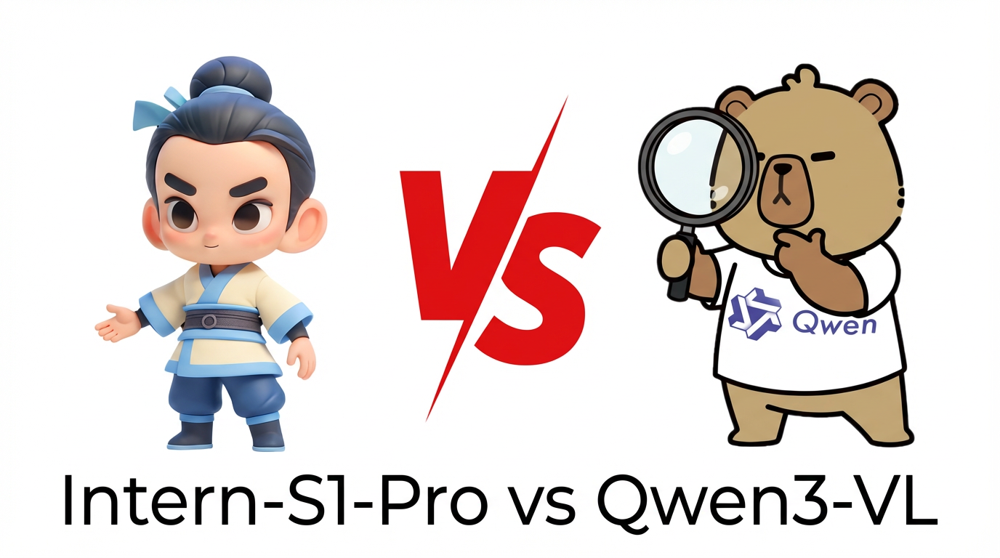

**[English](README.md) | [简体中文](README_CN.md)**

# 🤖 简介

Intern-S1 技术报告中提到该模型基于 Qwen3 和 InternVL-Vit 做的继续预训练，但论文中暂时没有更新关于 Intern-S1-Pro 的详细技术介绍，因此本项目探索 Qwen3-VL-235B-A22B-Instruct 和 Intern-S1-Pro 两个多模态 MoE 模型的 config 配置、modeling 代码等，并进行对比分析。

**TL;DR**: Intern-S1-Pro 通过将 Qwen3-235B-A22B 的 MoE 专家数从 128 扩展到 512（4倍），在相同架构下实现了 235B → 1T 的参数 Scaling Up，保持了相似的推理效率（激活参数均为~22B）。具体扩展专家是否以及如何复用 Qwen3-235B-A22B 专家权重，暂时未知。

## 📦 项目结构

```
intern-s1-pro-vs-qwen3-235b-a22b/
├── checkpoints/
│   ├── Intern-S1-Pro/              # 不含权重
│   │   ├── config.json             # 模型配置
│   │   ├── modeling_*.py           # 模型实现
│   │   └── ...
│   └── Qwen3-VL-235B-A22B-Instruct/  # 不含权重
│       ├── config.json
│       ├── modeling_*.py
│       └── ...
├── logo.png
├── README.md                       # 本文件 (English)
└── README_CN.md                    # 中文版
```


## 💡 模型对比总览

| 特性 | Intern-S1-Pro | Qwen3-VL-235B-A22B |
|------|--------------|-------------------|
| **总参数量** | **~920B (≈1T)** | **~235B** |
| **激活参数** | 22B | 22B |
| **MoE 专家数** | **512** | **128** |
| **专家激活数** | 8 | 8 |
| **隐藏层数** | 94 | 94 |
| **隐藏维度** | 4096 | 4096 |
| **注意力头** | 64 | 64 |
| **KV 头数** | 4 (GQA) | 4 (GQA) |
| **上下文长度** | 262K | 262K |

## ⚙️ Config 配置详细对比

### 文本模型配置 (text_config)

| 配置项 | Intern-S1-Pro | Qwen3-VL-235B | 说明 |
|--------|--------------|---------------|------|
| **基础架构** |  |  |  |
| model_type | `interns1_pro_text` | `qwen3_vl_moe_text` | 模型类型标识 |
| hidden_size | 4096 | 4096 | 隐藏层维度 |
| num_hidden_layers | 94 | 94 | Transformer 层数 |
| intermediate_size | 12288 | 12288 | FFN 中间层维度 |
| **注意力机制** |  |  |  |
| num_attention_heads | 64 | 64 | 注意力头数量 |
| num_key_value_heads | 4 | 4 | KV 头数量（GQA） |
| head_dim | 128 | 128 | 每个注意力头维度 |
| attention_dropout | 0.0 | 0.0 | 注意力dropout |
| attention_bias | false | false | 注意力是否使用偏置 |
| **MoE 配置** ⭐ |  |  |  |
| **num_experts** | **512** | **128** | 🔥 专家总数（4倍差异） |
| num_experts_per_tok | 8 | 8 | 每个token激活的专家数 |
| moe_intermediate_size | 1536 | 1536 | 每个专家的中间维度 |
| **router_n_groups** | **8** | ❌ | 🔥 路由分组数（Intern独有） |
| norm_topk_prob | true | true | 是否归一化top-k概率 |
| decoder_sparse_step | 1 | 1 | 解码器稀疏步长 |
| **词表与Token** |  |  |  |
| vocab_size | 155,008 | 151,936 | 词表大小 |
| bos_token_id | 151643 | 151643 | 起始token ID |
| eos_token_id | 151645 | 151645 | 结束token ID |
| **位置编码** |  |  |  |
| rope_theta | 5,000,000 | 5,000,000 | RoPE 基础频率 |
| rope_type | `default` | `default` | RoPE 类型 |
| **fope_init_factor** | **0.5** | ❌ | 🔥 FoPE 初始化因子（Intern独有） |
| **fope_sep_head** | **true** | ❌ | 🔥 FoPE 分离头（Intern独有） |
| **mrope_interleaved** | ❌ | **true** | 🔥 交错MRoPE（Qwen独有） |
| **mrope_section** | ❌ | **[24, 20, 20]** | 🔥 MRoPE分段（Qwen独有） |
| max_position_embeddings | 262,144 | 262,144 | 最大位置编码长度（256K） |
| **归一化** |  |  |  |
| rms_norm_eps | 1e-06 | 1e-06 | RMSNorm epsilon |
| **其他** |  |  |  |
| hidden_act | `silu` | `silu` | 激活函数 |
| initializer_range | 0.02 | 0.02 | 参数初始化范围 |
| mlp_only_layers | [] | [] | 仅MLP的层 |
| use_cache | true | true | 是否使用KV缓存 |
| dtype | bfloat16 | bfloat16 | 数据类型 |

### 视觉模型配置 (vision_config)

| 配置项 | Intern-S1-Pro | Qwen3-VL-235B | 说明 |
|--------|--------------|---------------|------|
| **基础架构** |  |  |  |
| model_type | `interns1_pro_vision` | `qwen3_vl_moe` | 视觉模型类型 |
| **depth** | **24** | **27** | ViT 层数 |
| **hidden_size** | **1024** | **1152** | 隐藏层维度 |
| **intermediate_size** | **4096** | **4304** | FFN 中间维度 |
| num_heads | 16 | 16 | 注意力头数 |
| **补丁配置** |  |  |  |
| patch_size | 16 | 16 | 图像补丁大小 |
| temporal_patch_size | 2 | 2 | 时间补丁大小（视频） |
| spatial_merge_size | 2 | 2 | 空间合并尺寸 |
| in_channels | 3 | 3 | 输入通道数（RGB） |
| **特征融合** |  |  |  |
| **deepstack_visual_indexes** | ❌ | **[8, 16, 24]** | 🔥 DeepStack层索引（Qwen独有） |
| **输出配置** |  |  |  |
| out_hidden_size | 4096 | 4096 | 输出隐藏维度（对齐文本） |
| num_position_embeddings | 2304 | 2304 | 位置编码数量 |
| **其他** |  |  |  |
| hidden_act | `gelu_pytorch_tanh` | `gelu_pytorch_tanh` | 激活函数 |
| initializer_range | 0.02 | 0.02 | 参数初始化范围 |

### 量化配置 (quantization_config)

| 配置项 | Intern-S1-Pro | Qwen3-VL-235B | 说明 |
|--------|--------------|---------------|------|
| **量化方法** | **FP8** | ❌ | Intern-S1-Pro 使用 FP8 量化 |
| quant_method | `fp8` | - | 量化方法 |
| fmt | `e4m3` | - | FP8 格式（4位指数，3位尾数） |
| scale_fmt | `ue8m0` | - | 缩放因子格式 |
| weight_block_size | [128, 128] | - | 权重块大小 |
| activation_scheme | `dynamic` | - | 激活量化方案 |
| modules_to_not_convert | 698个模块 | - | 不转换的模块列表 |

### 特殊 Token 配置

| Token | Intern-S1-Pro | Qwen3-VL-235B | 说明 |
|-------|--------------|---------------|------|
| image_token_id | 151655 | 151655 | 图像占位符 |
| video_token_id | 151656 | 151656 | 视频占位符 |
| vision_start_token_id | 151652 | 151652 | 视觉开始标记 |
| vision_end_token_id | 151653 | 151653 | 视觉结束标记 |

### 🔍 关键配置差异总结

#### 1️⃣ **MoE 专家数量** (最核心差异)
- **Intern-S1-Pro**: 512 专家 + 8 组路由管理
- **Qwen3-VL**: 128 专家，无分组
- **影响**: 直接导致 ~4 倍参数量差异

#### 2️⃣ **位置编码策略**
- **Intern-S1-Pro**: FoPE (Fourier Position Encoding)
  - 专为科学信号和时间序列优化
  - `fope_init_factor=0.5`, `fope_sep_head=true`
- **Qwen3-VL**: Interleaved MRoPE
  - 多维度交错编码（时间、宽度、高度）
  - `mrope_section=[24, 20, 20]` 三维分配

#### 3️⃣ **视觉编码器**
- **Intern-S1-Pro**: 24 层，1024 维，更轻量
- **Qwen3-VL**: 27 层，1152 维，支持 DeepStack 多层特征融合

#### 4️⃣ **量化支持**
- **Intern-S1-Pro**: 内置 FP8 量化（e4m3格式）
  - 698 个关键模块保持高精度
- **Qwen3-VL**: 未内置量化配置

#### 5️⃣ **词表大小**
- **Intern-S1-Pro**: 155,008 tokens
  - 额外包含专业领域 tokenizer（PROT、SMILES、XNA）
- **Qwen3-VL**: 151,936 tokens


## 📊 详细参数量分析

### Intern-S1-Pro (~1T 参数)

```
总参数量: 920B
├─ 文本模型:      916.56B (99.97%)
│  ├─ Embedding:    0.63B
│  ├─ 94 Layers:  915.29B
│  │  ├─ Attention per layer:    0.071B
│  │  ├─ MoE Experts (512个):    9.66B  ⬅️ 核心差异
│  │  └─ Router per layer:       2.10M
│  └─ LM Head:      0.63B
└─ 视觉模型:        0.31B (0.03%)
   ├─ 深度: 24 层
   ├─ 隐藏维度: 1024
   └─ 中间维度: 4096

激活参数: 22.36B (仅 2.4%)
```

### Qwen3-VL-235B-A22B (~235B 参数)

```
总参数量: 235.51B
├─ 文本模型:      235.09B (99.82%)
│  ├─ Embedding:    0.62B
│  ├─ 94 Layers:  233.85B
│  │  ├─ Attention per layer:    0.071B
│  │  ├─ MoE Experts (128个):    2.42B
│  │  └─ Router per layer:       0.52M
│  └─ LM Head:      0.62B
└─ 视觉模型:        0.42B (0.18%)
   ├─ 深度: 27 层
   ├─ 隐藏维度: 1152
   └─ 中间维度: 4304

激活参数: 22.19B (9.4%)
```

### 🔍 为什么 Intern-S1-Pro 是 1T 参数？

**关键原因：MoE 专家数量差异**

- **Intern-S1-Pro**: 512 个专家
- **Qwen3-VL**: 128 个专家
- **差距**: **4 倍**

**每层 MoE 参数量**
- Intern-S1-Pro 每层: 9.66B (512 专家)
- Qwen3-VL 每层: 2.42B (128 专家)
- 94 层累积：**681B vs 170B** 的差距

**但实际推理效率相似**
- 两个模型都只激活 **8 个专家**
- 激活参数都约为 **22B**
- 推理显存和计算成本接近


## ✨ 模型特点对比

### Intern-S1-Pro 特色功能

#### 🔬 科学推理专精
- **AI4Science 优化**: 化学、材料、生命科学、地球科学
- **物理信号建模**: 支持长时间序列（10^0 ~ 10^6 个点）
- **专业 Tokenizer**:
  - `tokenizer_PROT.model` - 蛋白质序列
  - `tokenizer_SMILES.model` - 化学分子式
  - `tokenizer_XNA.model` - 核酸序列

#### 🧠 Thinking Mode
- 默认启用思考模式增强推理
- 可通过 `enable_thinking=False` 关闭

#### ⚙️ 技术创新
- **FoPE (Fourier Position Encoding)**: 更好的位置编码
- **STE Routing**: 密集梯度路由训练
- **Grouped Routing**: 8 组专家管理（router_n_groups=8）
- **FP8 量化**: 降低显存占用

### Qwen3-VL 特色功能

#### 🌐 通用视觉理解
- **Visual Agent**: 操作 PC/移动端 GUI
- **视觉编码增强**: 生成 Draw.io/HTML/CSS/JS
- **"识别一切"**: 名人、动漫、产品、地标、动植物

#### 📹 高级视频理解
- **原生 256K 上下文**, 可扩展至 1M
- **秒级视频索引**: 处理小时级视频
- **Text-Timestamp Alignment**: 精确时间戳定位

#### 🏗️ 架构升级
- **Interleaved-MRoPE**: 多维位置编码（时间、宽度、高度）
- **DeepStack**: 多层 ViT 特征融合（第 8、16、24 层）
- **32 语言 OCR**: 支持低光、模糊、倾斜场景


## 📝 计算方法说明

### 参数量计算公式

#### 1️⃣ **基础组件参数（每层）**

```python
# Attention 参数（GQA - Grouped Query Attention）
Attention = 4 × hidden_size² × (1 + num_kv_heads / num_q_heads)
          = 4 × 4096² × (1 + 4/64)
          = 71,303,168 ≈ 0.071B

# Router 参数（路由到专家）
Router = hidden_size × num_experts
       = 4096 × 512 (Intern-S1-Pro) 或 4096 × 128 (Qwen3-VL)
       = 2.10M (Intern) 或 0.52M (Qwen)

# LayerNorm 参数（2个：pre-attn + post-attn）
LayerNorm = 2 × hidden_size
          = 2 × 4096
          = 8,192
```

#### 2️⃣ **MoE 专家参数（每层）**

```python
# 单个专家参数（使用 SwiGLU）
Expert_params = 3 × hidden_size × moe_intermediate_size
              = 3 × 4096 × 1536
              = 18,874,368 ≈ 18.87M

# 所有专家总参数（每层）
MoE_total = num_experts × Expert_params
          = 512 × 18.87M (Intern) 或 128 × 18.87M (Qwen)
          = 9.66B (Intern) 或 2.42B (Qwen)

# 激活的专家参数（每层，推理时）
MoE_activated = num_experts_per_tok × Expert_params
              = 8 × 18.87M
              = 150,994,944 ≈ 0.151B
```

#### 3️⃣ **总参数量（完整模型）**

```python
# Embedding 层
Embedding = vocab_size × hidden_size
          = 155,008 × 4096 (Intern) 或 151,936 × 4096 (Qwen)
          = 0.635B (Intern) 或 0.622B (Qwen)

# 所有 Transformer 层（包含所有专家）
All_layers_total = num_layers × (Attention + Router + LayerNorm + MoE_total)
                 = 94 × (0.071B + 2.10M + 8,192 + 9.66B)    [Intern]
                 = 94 × 9.737B
                 = 915.29B

# LM Head（输出层）
LM_head = hidden_size × vocab_size
        = 0.635B (Intern) 或 0.622B (Qwen)

# 【总参数量】
Total = Embedding + All_layers_total + LM_head
      = 0.635B + 915.29B + 0.635B
      = 916.56B ≈ 0.92T (Intern-S1-Pro)

      或

      = 0.622B + 233.85B + 0.622B
      = 235.09B (Qwen3-VL)
```

#### 4️⃣ **激活参数量（推理时）**

```python
# 所有层的激活参数（仅激活部分专家）
All_layers_activated = num_layers × (Attention + Router + LayerNorm + MoE_activated)
                     = 94 × (0.071B + 2.10M + 8,192 + 0.151B)
                     = 94 × 0.224B
                     = 21.09B

# 【推理时激活参数】
Activated_total = Embedding + All_layers_activated + LM_head
                = 0.635B + 21.09B + 0.635B
                = 22.36B (Intern-S1-Pro)

                或

                = 0.622B + 20.94B + 0.622B
                = 22.19B (Qwen3-VL)
```

### 📊 计算结果对比

| 指标 | Intern-S1-Pro | Qwen3-VL | 说明 |
|------|--------------|----------|------|
| **总参数** | 0.92T | 235.09B | Intern 是 Qwen 的 3.9 倍 |
| **激活参数** | 22.36B | 22.19B | 几乎相同（差异 < 1%）|
| **激活率** | 2.44% | 9.44% | Intern 专家更多，激活率更低 |
| **专家数** | 512 | 128 | 4 倍差异 |
| **每次激活** | 8 专家 | 8 专家 | 相同 |


- 专家总数   →  决定总参数量（920B vs 235B）→ 影响部署成本
- 激活专家数 →  决定激活参数量（22.36B vs 22.19B）→ 影响推理成本
- Intern-S1-Pro：用 4 倍的部署成本，换取更强的科学能力


## 📚 参考资料

### Intern-S1-Pro
- 🤗 [Hugging Face](https://huggingface.co/internlm/Intern-S1-Pro)
- 📄 [技术报告](https://arxiv.org/abs/2508.15763)
- 🏠 [官方仓库](https://github.com/InternLM/Intern-S1)

### Qwen3-VL
- 🤗 [Hugging Face](https://huggingface.co/Qwen/Qwen3-VL-235B-A22B-Instruct)
- 📄 [技术报告(Qwen3)](https://arxiv.org/abs/2505.09388)
- 📄 [技术报告(Qwen3-VL)](https://arxiv.org/abs/2511.21631)


## 📄 许可证

- Intern-S1-Pro: Apache 2.0
- Qwen3-VL: Apache 2.0
