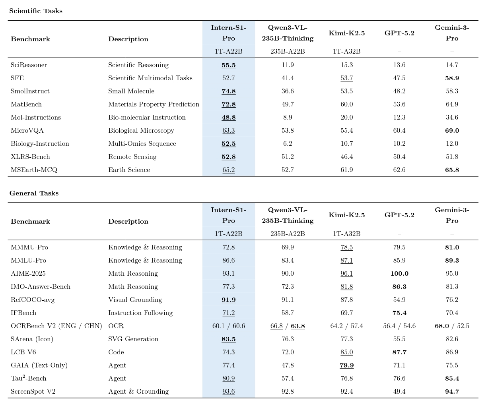

## Intern-S1-Pro

<div align="center">


  <div>&nbsp;</div>

[💻Github Repo](https://github.com/InternLM/Intern-S1) • [🤗Model Collections](https://huggingface.co/collections/internlm/intern-s1-6882e325e8ac1c58ba108aa5) • [📜Technical Report](https://arxiv.org/abs/2508.15763) • [💬Online Chat](https://chat.intern-ai.org.cn/)

</div>

<p align="center">
    👋 join us on <a href="https://discord.gg/xa29JuW87d" target="_blank">Discord</a> and <a href="https://cdn.vansin.top/intern-s1.jpg" target="_blank">WeChat</a>
</p>


## Introduction

We introduce **Intern-S1-Pro**, a trillion-scale MoE multimodal scientific reasoning model. Intern-S1-Pro scales to 1T total parameters with 512 experts, activating 8 experts per token (22B activated parameters). The model delivers top-tier performance on advanced reasoning benchmarks and achieves leading results across key AI4Science domains (chemistry, materials, life-science, earth, etc.), while maintaining strong general multimodal and text capabilities.

### Features

- **State-of-the-art scientific reasoning**, competitive with leading closed-source models across AI4Science tasks.
- **Strong general multimodal performance** on various benchmarks.
- **Trillion-scale MoE training efficiency** with **STE** routing (dense gradient for router training)  and **grouped routing** for stable convergence and balanced expert parallelism.
- **Fourier Position Encoding (FoPE)  + upgraded time-series modeling** for better physical signal representation; supports long, heterogeneous time-series (10^0–10^6 points).

### Performance

We evaluate the Intern-S1-Pro on various benchmarks, including general datasets and scientific datasets. We report the performance comparison with the recent VLMs and LLMs below. 




> **Note**: <u>Underline</u> means the best performance among open-sourced models, **Bold** indicates the best performance among all models.

We use the [OpenCompass](https://github.com/open-compass/OpenCompass/) and [VLMEvalKit](https://github.com/open-compass/vlmevalkit) to evaluate all models.


## Quick Start

### Sampling Parameters

We recommend using the following hyperparameters to ensure better results

```python
top_p = 0.95
top_k = 50
min_p = 0.0
temperature = 0.8
```

### Serving

Intern-S1-Pro can be deployed using any of the following LLM inference frameworks:

- LMDeploy
- vLLM
- SGLang

Detailed deployment examples for these frameworks are available in the [Model Deployment Guide](./deployment_guide.md).

> Deployment support for the time-series module is under optimization and will be released soon.


## Advanced Usage

### Tool Calling

Many Large Language Models (LLMs) now feature Tool Calling, a powerful capability that allows them to extend their functionality by interacting with external tools and APIs. This enables models to perform tasks like fetching up-to-the-minute information, running code, or calling functions within other applications.

A key advantage for developers is that a growing number of open-source LLMs are designed to be compatible with the OpenAI API. This means you can leverage the same familiar syntax and structure from the OpenAI library to implement tool calling with these open-source models. As a result, the code demonstrated in this tutorial is versatile—it works not just with OpenAI models, but with any model that follows the same interface standard.

To illustrate how this works, let's dive into a practical code example that uses tool calling to get the latest weather forecast (based on lmdeploy api server).

```python      
      

from openai import OpenAI
import json


def get_current_temperature(location: str, unit: str = "celsius"):
    """Get current temperature at a location.

    Args:
        location: The location to get the temperature for, in the format "City, State, Country".
        unit: The unit to return the temperature in. Defaults to "celsius". (choices: ["celsius", "fahrenheit"])

    Returns:
        the temperature, the location, and the unit in a dict
    """
    return {
        "temperature": 26.1,
        "location": location,
        "unit": unit,
    }


def get_temperature_date(location: str, date: str, unit: str = "celsius"):
    """Get temperature at a location and date.

    Args:
        location: The location to get the temperature for, in the format "City, State, Country".
        date: The date to get the temperature for, in the format "Year-Month-Day".
        unit: The unit to return the temperature in. Defaults to "celsius". (choices: ["celsius", "fahrenheit"])

    Returns:
        the temperature, the location, the date and the unit in a dict
    """
    return {
        "temperature": 25.9,
        "location": location,
        "date": date,
        "unit": unit,
    }

def get_function_by_name(name):
    if name == "get_current_temperature":
        return get_current_temperature
    if name == "get_temperature_date":
        return get_temperature_date

tools = [{
    'type': 'function',
    'function': {
        'name': 'get_current_temperature',
        'description': 'Get current temperature at a location.',
        'parameters': {
            'type': 'object',
            'properties': {
                'location': {
                    'type': 'string',
                    'description': 'The location to get the temperature for, in the format \'City, State, Country\'.'
                },
                'unit': {
                    'type': 'string',
                    'enum': [
                        'celsius',
                        'fahrenheit'
                    ],
                    'description': 'The unit to return the temperature in. Defaults to \'celsius\'.'
                }
            },
            'required': [
                'location'
            ]
        }
    }
}, {
    'type': 'function',
    'function': {
        'name': 'get_temperature_date',
        'description': 'Get temperature at a location and date.',
        'parameters': {
            'type': 'object',
            'properties': {
                'location': {
                    'type': 'string',
                    'description': 'The location to get the temperature for, in the format \'City, State, Country\'.'
                },
                'date': {
                    'type': 'string',
                    'description': 'The date to get the temperature for, in the format \'Year-Month-Day\'.'
                },
                'unit': {
                    'type': 'string',
                    'enum': [
                        'celsius',
                        'fahrenheit'
                    ],
                    'description': 'The unit to return the temperature in. Defaults to \'celsius\'.'
                }
            },
            'required': [
                'location',
                'date'
            ]
        }
    }
}]


messages = [
    {'role': 'user', 'content': 'Today is 2024-11-14, What\'s the temperature in San Francisco now? How about tomorrow?'}
]

openai_api_key = "EMPTY"
openai_api_base = "http://0.0.0.0:23333/v1"
client = OpenAI(
    api_key=openai_api_key,
    base_url=openai_api_base,
)
model_name = client.models.list().data[0].id
response = client.chat.completions.create(
    model=model_name,
    messages=messages,
    max_tokens=32768,
    temperature=0.8,
    top_p=0.95,
    extra_body=dict(spaces_between_special_tokens=False),
    tools=tools)
print(response.choices[0].message)
messages.append(response.choices[0].message)

for tool_call in response.choices[0].message.tool_calls:
    tool_call_args = json.loads(tool_call.function.arguments)
    tool_call_result = get_function_by_name(tool_call.function.name)(**tool_call_args)
    tool_call_result = json.dumps(tool_call_result, ensure_ascii=False)
    messages.append({
        'role': 'tool',
        'name': tool_call.function.name,
        'content': tool_call_result,
        'tool_call_id': tool_call.id
    })

response = client.chat.completions.create(
    model=model_name,
    messages=messages,
    temperature=0.8,
    top_p=0.95,
    extra_body=dict(spaces_between_special_tokens=False),
    tools=tools)
print(response.choices[0].message)
```

### Switching Between Thinking and Non-Thinking Modes

Intern-S1-Pro enables thinking mode by default, enhancing the model's reasoning capabilities to generate higher-quality responses. This feature can be disabled by setting `enable_thinking=False` in `tokenizer.apply_chat_template`

```python
text = tokenizer.apply_chat_template(
    messages,
    tokenize=False,
    add_generation_prompt=True,
    enable_thinking=False  # think mode indicator
)
```

With serving Intern-S1-Pro models, you can dynamically control the thinking mode by adjusting the `enable_thinking` parameter in your requests.

```python
from openai import OpenAI
import json

messages = [
{
    'role': 'user',
    'content': 'who are you'
}, {
    'role': 'assistant',
    'content': 'I am an AI'
}, {
    'role': 'user',
    'content': 'AGI is?'
}]

openai_api_key = "EMPTY"
openai_api_base = "http://0.0.0.0:23333/v1"
client = OpenAI(
    api_key=openai_api_key,
    base_url=openai_api_base,
)
model_name = client.models.list().data[0].id

response = client.chat.completions.create(
    model=model_name,
    messages=messages,
    temperature=0.8,
    top_p=0.95,
    max_tokens=2048,
    extra_body={
        "chat_template_kwargs": {"enable_thinking": False}
    }
)
print(json.dumps(response.model_dump(), indent=2, ensure_ascii=False))
```

## Citation

If you find this work useful, feel free to give us a cite.

```
@misc{bai2025interns1scientificmultimodalfoundation,
      title={Intern-S1: A Scientific Multimodal Foundation Model},
      author={Lei Bai and Zhongrui Cai and Maosong Cao and Weihan Cao and Chiyu Chen and Haojiong Chen and Kai Chen and Pengcheng Chen and Ying Chen and Yongkang Chen and Yu Cheng and Yu Cheng and Pei Chu and Tao Chu and Erfei Cui and Ganqu Cui and Long Cui and Ziyun Cui and Nianchen Deng and Ning Ding and Nanqin Dong and Peijie Dong and Shihan Dou and Sinan Du and Haodong Duan and Caihua Fan and Ben Gao and Changjiang Gao and Jianfei Gao and Songyang Gao and Yang Gao and Zhangwei Gao and Jiaye Ge and Qiming Ge and Lixin Gu and Yuzhe Gu and Aijia Guo and Qipeng Guo and Xu Guo and Conghui He and Junjun He and Yili Hong and Siyuan Hou and Caiyu Hu and Hanglei Hu and Jucheng Hu and Ming Hu and Zhouqi Hua and Haian Huang and Junhao Huang and Xu Huang and Zixian Huang and Zhe Jiang and Lingkai Kong and Linyang Li and Peiji Li and Pengze Li and Shuaibin Li and Tianbin Li and Wei Li and Yuqiang Li and Dahua Lin and Junyao Lin and Tianyi Lin and Zhishan Lin and Hongwei Liu and Jiangning Liu and Jiyao Liu and Junnan Liu and Kai Liu and Kaiwen Liu and Kuikun Liu and Shichun Liu and Shudong Liu and Wei Liu and Xinyao Liu and Yuhong Liu and Zhan Liu and Yinquan Lu and Haijun Lv and Hongxia Lv and Huijie Lv and Qidang Lv and Ying Lv and Chengqi Lyu and Chenglong Ma and Jianpeng Ma and Ren Ma and Runmin Ma and Runyuan Ma and Xinzhu Ma and Yichuan Ma and Zihan Ma and Sixuan Mi and Junzhi Ning and Wenchang Ning and Xinle Pang and Jiahui Peng and Runyu Peng and Yu Qiao and Jiantao Qiu and Xiaoye Qu and Yuan Qu and Yuchen Ren and Fukai Shang and Wenqi Shao and Junhao Shen and Shuaike Shen and Chunfeng Song and Demin Song and Diping Song and Chenlin Su and Weijie Su and Weigao Sun and Yu Sun and Qian Tan and Cheng Tang and Huanze Tang and Kexian Tang and Shixiang Tang and Jian Tong and Aoran Wang and Bin Wang and Dong Wang and Lintao Wang and Rui Wang and Weiyun Wang and Wenhai Wang and Yi Wang and Ziyi Wang and Ling-I Wu and Wen Wu and Yue Wu and Zijian Wu and Linchen Xiao and Shuhao Xing and Chao Xu and Huihui Xu and Jun Xu and Ruiliang Xu and Wanghan Xu and GanLin Yang and Yuming Yang and Haochen Ye and Jin Ye and Shenglong Ye and Jia Yu and Jiashuo Yu and Jing Yu and Fei Yuan and Bo Zhang and Chao Zhang and Chen Zhang and Hongjie Zhang and Jin Zhang and Qiaosheng Zhang and Qiuyinzhe Zhang and Songyang Zhang and Taolin Zhang and Wenlong Zhang and Wenwei Zhang and Yechen Zhang and Ziyang Zhang and Haiteng Zhao and Qian Zhao and Xiangyu Zhao and Xiangyu Zhao and Bowen Zhou and Dongzhan Zhou and Peiheng Zhou and Yuhao Zhou and Yunhua Zhou and Dongsheng Zhu and Lin Zhu and Yicheng Zou},
      year={2025},
      eprint={2508.15763},
      archivePrefix={arXiv},
      primaryClass={cs.LG},
      url={https://arxiv.org/abs/2508.15763},
}
```
